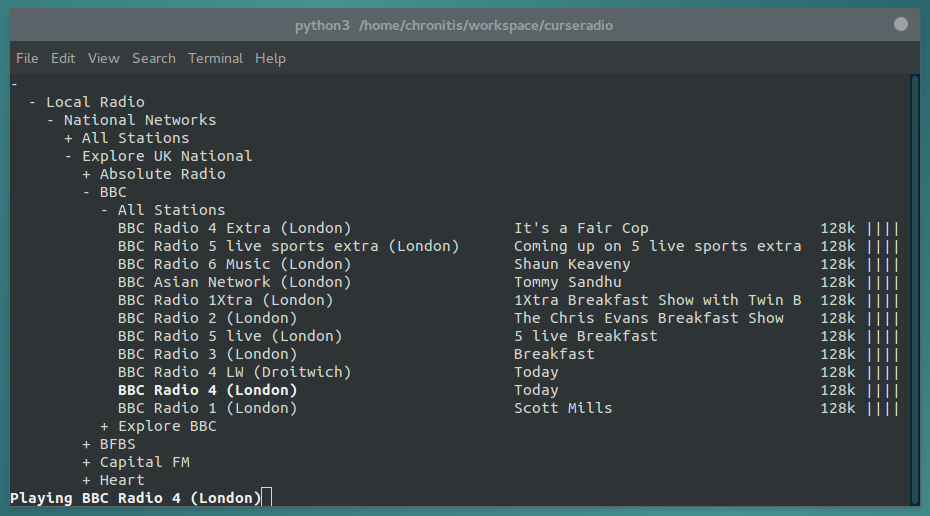

Curseradio
==========

> Internet radio in the terminal

Curseradio is a `curses` interface for browsing and playing an `OPML` directory of internet radio streams. It is designed to use the *tunein* directory found at <http://opml.radiotime.com/>, but could be adapted to others.

Audio playback uses [`mpv`](http://mpv.io/). Curseradio requires `python3` and the libraries `requests` and `lxml`.

